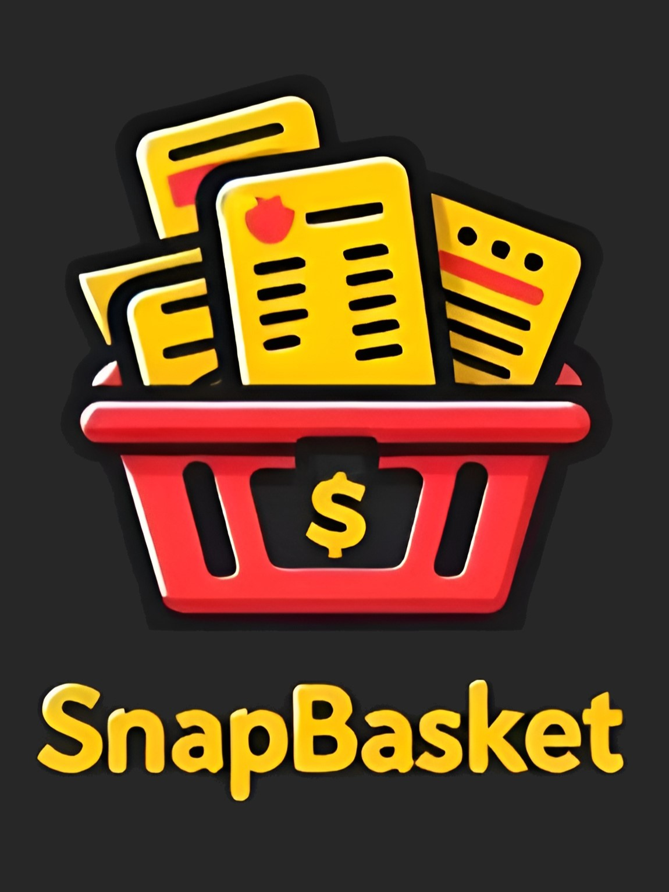

# SnapBasket 📸🛒
## Organize Your Shopping Effortlessly and Intelligently

### Application Overview
SnapBasket is a mobile application designed to streamline and enhance the daily shopping experience. With SnapBasket, users can scan their receipts, track expenses, create personalized shopping lists, manage budgets, and minimize food waste. The app provides users with valuable insights and data-driven recommendations to make smarter purchasing decisions.

### Problem We’re Solving
Daily shopping often involves organizational challenges that can lead to unnecessary spending, lack of tracking, and excessive waste. From handling receipts and budgeting to tracking ingredient needs, the process can quickly become overwhelming without a centralized solution.

### Proposed Solution
SnapBasket aims to provide comprehensive information by analyzing and reorganizing data primarily from receipts, as well as from user habits and preferences. By consolidating these insights, SnapBasket helps users limit expenses, reduce waste, and optimize the overall shopping experience.

### Key Features
- **Receipt Scanning:** Easily scan receipts to automatically capture and log items, prices, quantities, and stores visited;
- **Budget Management:** Set weekly or monthly budgets and track spending with visual reports and budget alerts;
- **Smart Shopping List:** Create customized shopping lists, with reminders for frequently bought items and options to sort by store;
- **Recipe-Based Lists:** Generate shopping lists directly from recipes, ensuring you always have the ingredients you need;
- **Dietary & Allergy Tracking:** Set dietary preferences or restrictions to receive alerts and tailor shopping lists accordingly;
- **Purchase Insights:** Get reminders based on previous purchases and trends, so you never miss regularly used items;
- **Deals & Price Comparisons:** Compare prices across stores and get alerts for deals to make cost-effective decisions;
- **Multi-Store Management:** Track and organize purchases across different stores, keeping a record of prices and preferences;
- **Analytics & Spending Reports:** Visualize spending habits with charts and graphs that highlight where money is being spent;
- **Shared Lists & Receipts:** Share lists and receipts with family or roommates for easy collaboration;
- **Recipe Suggestions:** Get recipe ideas based on previously purchased ingredients, helping reduce food waste;

SnapBasket is here to make grocery shopping easier, more organized, and cost-effective for everyone. Say goodbye to wasted food and overspending!

## Requirements Gathering

### Functional Requirements:
- **User Registration & Authentication:** Users can sign up, log in, and log out securely using email (or social media accounts);

- **Shopping List Creation:** Users can create and manage custom shopping lists, including the ability to save frequently bought items and organize lists by store;

- **Receipt Scanning & Item Logging:** Users can scan receipts using OCR technology to automatically log items, prices, quantities, and store details;

- **Budget Management:** Users can set weekly or monthly spending limits, with real-time tracking and alerts when nearing their budget;

- **Recipe-Based List Generation:** Users can generate shopping lists based on selected recipes, ensuring all required ingredients are included;

- **Dietary & Allergy Tracking:** Users can set dietary preferences and allergy information to receive alerts on relevant items during shopping list creation;

- **Deals & Price Comparison:** Users receive notifications for relevant deals and can compare prices across various stores;

- **Analytics & Spending Reports:** The app provides visualized reports (charts and graphs) to display users’ spending habits over time;

- **Shared Lists & Receipts:** Users can share lists and receipts with family members or roommates for easy collaboration and split costs.

### Non-Functional Requirements:
- **Performance:** The app is optimized to handle multiple users concurrently, especially during peak shopping hours, without performance lag;

- **Security:** All user data, including shopping preferences and payment information, is encrypted and securely stored, following GDPR compliance;

- **Usability:** The app interface is designed to be intuitive and accessible, with clear navigation, easy-to-use buttons for all user levels;

- **Scalability:** The architecture supports easy addition of new features like expanded price tracking and more grocery store integrations;

- **Data Privacy:** User data privacy is prioritized, with options for users to control data usage and sharing preferences;

- **Compatibility:** The app is compatible with the latest versions of iOS and Android and optimized for various screen sizes and devices.

### Technologies Used
- **Backend + Database: Firebase** 
- **Frontend: Flutter**
- **OCR for Receipt Scanning:** 
- **Data Visualization:** 

### License
This project is licensed under the MIT License.
